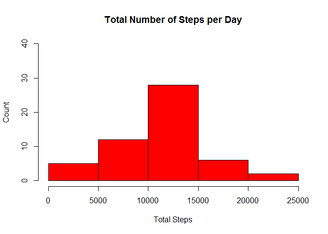
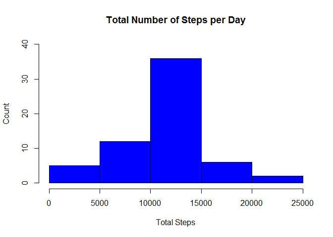
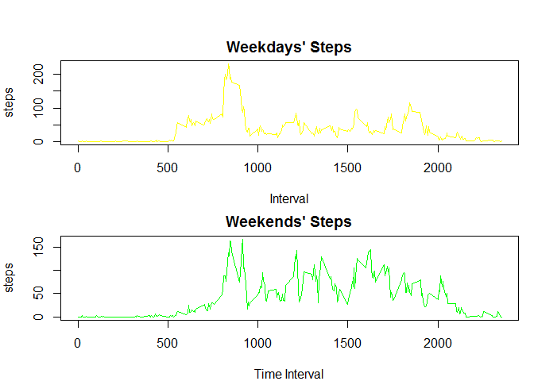

## Loading and preprocessing the data


```r
knitr::opts_chunk$set(echo = TRUE)
```

Loading the data and saving it to an object


```r
activity <- read.csv(".//activity.csv")
```

## What is mean total number of steps taken per day?

First I will aggregate the total number of sums per day removing NAs to then
plot the histogram
Finally I will calculate the mean and median of the total number of steps taken per day


```r
stepshist <- aggregate(activity$steps ~ activity$date, FUN = sum)
hist(stepshist$`activity$steps`, main = "Total Number of Steps per Day", xlab = "Total Steps", ylab = "Count", col = "red", ylim = c(0, 40))
```

<!-- -->

```r
meansteps <- mean(stepshist$`activity$steps`)
mediansteps <- median(stepshist$`activity$steps`)
```

The mean is `meansteps` and the median is `mediansteps`

## What is the average daily activity pattern?

I will take the mean of steps for every interval in the data set and then plot it into a timeline


```r
dailyactivity <- aggregate(steps ~ interval, data = activity, FUN = mean, rm.na = TRUE)
plot(dailyactivity, type = "l")
```

<!-- -->

Which 5 minute interval contains the maximum number of steps?


```r
maxinterval <- dailyactivity[which.max(dailyactivity$steps), ]$interval
```

`maxinterval`

## Imputing missing values

1. Total number of missing values in the dataset

 
 ```r
 missing <- sum(is.na(activity$steps))
 ```
`missing`

2. Filling missing values in a new dataset,using the mean of that 5 minute interval


```r
completedata <- activity
for (i in 1 : nrow(completedata)){
  if(is.na(completedata[i, "steps"])) {
    x <- completedata[i, "interval"]
      completedata[i, "steps"] <- dailyactivity[dailyactivity$interval == x, "steps"]
  }
}
sumnona <- sum(is.na(completedata$steps))
```
`sumnona`

3. New dataset with NA values imputed (showing only first lines):


```r
show <- head(completedata)
```
`show`

4. Histogram of total steps taken each day and mean and median of steps taken per day 


```r
newhistogram <- aggregate(steps ~ date, data = completedata, FUN = sum)
hist(newhistogram$steps, main = "Total Number of Steps per Day", xlab = "Total Steps", ylab = "Count", col = "blue", ylim = c(0,40))
```

<!-- -->

```r
meanona <- mean(newhistogram$steps)
mediannona <- median(newhistogram$steps)
```
The mean is `meanona` and the median is `mediannona`

Do these values differ?
The mean doesn't differ, however the median differs a little bit

What is the impact of imputing missing data on the estimates of the total daily number of steps?
Seeing the two different histograms, the distribution has changed, especially in the center bar (between 10000 and 15000 steps).

## Are there differences in activity patterns between weekdays and weekends?

I will create a new column which will serve as a factor for determining if a day is weekday or weekend. Then, the timeline will be made.


```r
completedata$daytype <- weekdays(as.Date(completedata$date))
completedata$daytype[completedata$daytype %in% c('sábado','domingo')] <-"weekend"
completedata$daytype[completedata$daytype != "weekend"] <-"weekday"
completedata$daytype <- as.factor(completedata$daytype)
```
Aggregating the data by type of day


```r
weekdays <- subset(completedata, daytype == "weekday")
weekdaysteps <- aggregate(steps ~ interval, data = weekdays, mean)

weekend <- subset(completedata, daytype == "weekend")
weekendsteps <- aggregate(steps ~ interval, data = weekend, mean)

par(mfrow=c(2,1), mar=c(4,4,2,1), oma=c(0,0,2,0))

with(completedata, {
    plot(steps ~ interval, data = weekdaysteps, type = "l",
main="Weekdays' Steps", xlab="Interval", col="yellow")
    plot(steps ~ interval, data = weekendsteps, type="l",
main="Weekends' Steps", xlab="Time Interval", col="green")
})
```

<!-- -->
